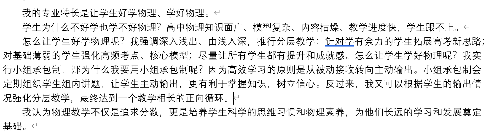
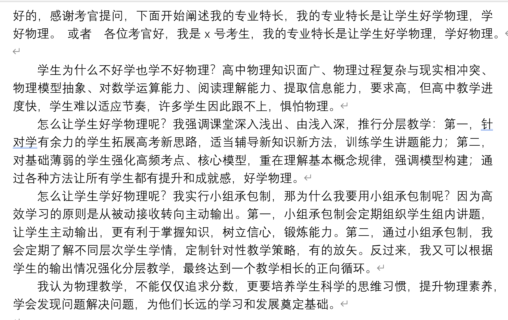

1.学习经历
  小学：2004.09-2010.06 广西壮族自治区桂林市全州县柘桥完全小学 唐小军
  初中：2010.09-201306 广西壮族自治区桂林市全州县第四初级中学 唐琼容
  高中：
    201309-201606 广西壮族自治区全州县高级中学 邓斌
  大学
    201609-201706 广西大学 计算机与电子信息学院 计算机科学与技术 肄业 李国荣
    201809-202209 华中师范大学 物理科学与技术学院 物理学 毕业 郝芳华

2.工作经历
  2022.09-202508 湖北省鄂州市葛店高级中学 高中物理教师 陈宝贵

  ### 介绍我的教学特长
  
  我的专业特长是让学生好学物理、学好物理。
学生为什么不好学也学不好物理？高中物理知识面广、模型复杂、内容枯燥、教学进度快，学生跟不上。
怎么让学生好学物理呢？我强调深入浅出、由浅入深，推行分层教学：针对学有余力的学生拓展高考新思路；对基础薄弱的学生强化高频考点、核心模型；尽量让所有学生都有提升和成就感。怎么让学生学好物理呢？我实行小组承包制，那为什么我要用小组承包制呢？因为高效学习的原则是从被动接收转向主动输出。小组承包制会定期组织学生组内讲题，让学生主动输出，更有利于掌握知识，树立信心。反过来，我又可以根据学生的输出情况强化分层教学，最终达到一个教学相长的正向循环。
我认为物理教学不仅是追求分数，更是培养学生科学的思维习惯和物理素养，为他们长远的学习和发展奠定基础。

