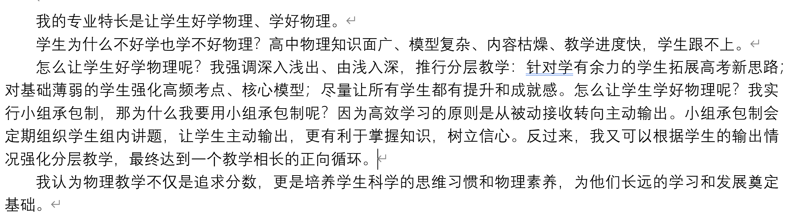
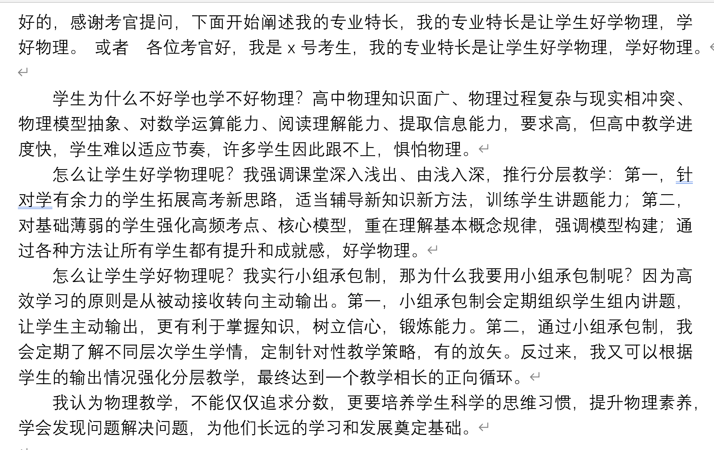

1.学习经历
  小学：2004.09-2010.06 广西壮族自治区桂林市全州县柘桥完全小学 唐小军
  初中：201009-201306 广西壮族自治区桂林市全州县第四初级中学 唐琼容
  高中：
    201309-201606 广西壮族自治区全州县高级中学 邓斌
  大学
    201609-201706 广西大学 计算机与电子信息学院 计算机科学与技术 080901 肄业 李国荣
    201809-202209 华中师范大学 物理科学与技术学院 物理学070201 毕业 郝芳华

2.工作经历
  202209-202508 湖北省鄂州市葛店高级中学 高中物理教师 陈宝贵

3.家庭成员
夫妻  孙瀚文 数沐（武汉）软件有限公司，工程师 

  ### 介绍我的教学特长
  
  我的专业特长是让学生好学物理、学好物理。
学生为什么不好学也学不好物理？高中物理知识面广、模型复杂、内容枯燥、教学进度快，学生跟不上。
怎么让学生好学物理呢？我强调深入浅出、由浅入深，推行分层教学：针对学有余力的学生拓展高考新思路；对基础薄弱的学生强化高频考点、核心模型；尽量让所有学生都有提升和成就感。怎么让学生学好物理呢？我实行小组承包制，那为什么我要用小组承包制呢？因为高效学习的原则是从被动接收转向主动输出。小组承包制会定期组织学生组内讲题，让学生主动输出，更有利于掌握知识，树立信心。反过来，我又可以根据学生的输出情况强化分层教学，最终达到一个教学相长的正向循环。
我认为物理教学不仅是追求分数，更是培养学生科学的思维习惯和物理素养，为他们长远的学习和发展奠定基础。

4.个人自传
本人刘秋妹，广西壮族自治区桂林市人，现为武汉市光谷第二高级中学高中物理教师。现将个人学习经历、工作经历、家庭关系、兴趣特长、奖惩情况以及诚信守法、道德践行情况如实自传如下。

一、学习经历

2004年9月至2010年6月，我就读于广西壮族自治区桂林市全州县柘桥完全小学；2010年9月至2013年6月，就读于全州县第四初级中学；2013年9月至2016年6月，就读于全州县高级中学。

2016年9月，我考入广西大学计算机与电子信息学院计算机科学与技术专业。入学后，我逐渐发现自己对教育教学有更强烈的向往，经过慎重考虑，我于2017年6月主动退学，未取得该专业毕业资格。2018年9月，我重新参加高考，进入华中师范大学物理科学与技术学院物理学专业学习，2022年6月毕业。大学期间曾获评校级“三好学生”，并获得博雅奖学金。

二、工作经历

2022年9月至2025年8月，我在湖北省鄂州市葛店高级中学担任高中物理教师；2025年9月至今，在武汉市光谷第二高级中学担任高中物理教师。

工作中，我主要承担高中物理教学任务，包括备课、上课、批改作业、辅导学生，以及参加学校组织的教研活动、考试命题和阅卷工作。2026年春季，我承担区级二轮复习示范课《抛体运动问题的研究》，听课教师和教研员给出充分肯定。

三、家庭关系、兴趣特长与奖惩情况

家庭方面，我已婚，丈夫孙瀚文，自由职业者。我们夫妻关系和睦，家庭生活简单稳定。双方父母身体尚可，平时保持联系，节假日尽量回去看望。

兴趣特长方面，我没有特别的文艺或体育特长，业余时间主要用来研究物理教学问题，比如整理典型题目、分析教学难点、琢磨某一类问题的讲法。这既是职业需要，也算是我的一点个人爱好。

奖惩情况：2023年，因教学成果优秀，被评为鄂州市葛店高级中学优秀教师；2025年，指导的学生在第42届全国中学生物理竞赛湖北赛区获全国二等奖，我获得优秀指导教师荣誉证书；2026年春季，承担区级二轮复习示范课《抛体运动问题的研究》获一致好评，并获评教学质量优秀称号。

四、个人诚信、遵纪守法及道德践行情况

诚信方面，我说话办事实事求是，不夸大、不隐瞒。工作中没有弄虚作假，没有违反考试纪律和学术规范的行为。遵纪守法方面，我自觉遵守国家法律法规和学校规章制度，没有违法违纪记录。

家庭美德方面，我和丈夫互敬互爱，家务共同分担，对双方父母尽到应有的关心和照顾，不推诿、不攀比。社会公德方面，我注意在公共场合的言行，遵守公共秩序，遇到能帮的小事会搭把手。

职业道德方面，我认真备课上课，不敷衍学生，对学生做到一视同仁。在教学中，我注重深入浅出、由浅入深，实行分层教学：对学有余力的学生拓展高考新思路，对基础薄弱的学生强化高频考点和核心模型，尽量让不同层次的学生都有提升和成就感。我认为物理教学不仅是追求分数，更重要的是培养学生科学的思维习惯和物理素养，让他们喜欢物理、热爱生活、学会解决问题，为长远的学习和发展打下基础。我知道自己还有很多不足，会终身学习，不断成长，踏踏实实做好本职工作。

以上是我的个人自传，内容真实，无夸大或者隐瞒。

5. 思想政治表现鉴定
刘秋妹，女，汉族，1998年8月出生，身份证号码：450324199808020728，本科学历，物理学专业。2025年8月在校以来担任高中物理教师。在我校工作期间，该同志思想积极进步，不断提高政治理论水平，工作态度端正，坚持学习，具有较强的事业心和责任感。服从学校安排，能按时完成各项工作，并能做到虚心向他人学习，不断提升自身教育教学水平。该同志自觉做到遵规守纪，无不良嗜好，无任何违规违纪行为，廉洁自律。特此证明
武汉市光谷第二高级中学
2026年8月26日