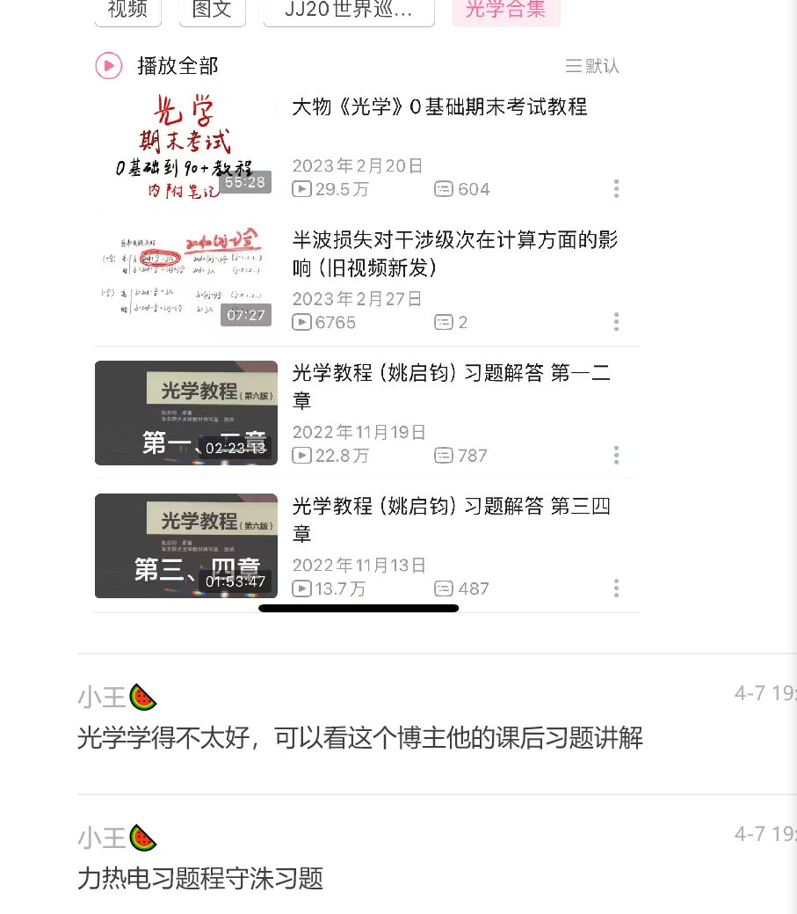

### 2026年4月8日
1. 明日计划
   1. 333 私人讲学的兴起与发展，孔子教育思想与教育实践；   4h
   2. 英语二 计划以及长难句一句，准备试题材料
   3. 物理 整理经验贴，写学习计划，完成第一天的学习
   4. 文具准备  笔记本购买，涂色笔购买等其他，以及吃的准备。
2. 工作计划
   1. 高考题，湖北卷，完整走一遍，晚上要复盘
   2. 下午上一节课，晚上自习，安排作业
   3. 做完高考题之后，出卷子
   4. 备课完成磁场部分备课。
3. 加油加油加油。

### 2026年4月9日
1. 英语备考
   1. jie斌斌 哔哩哔哩上有，长难句66   5月完成，一天一句，
   2. 背单词  每天150词，红宝书乱序版，预计两个月完成一轮，  朱伟恋念有词学习词根词缀，在百度网盘，通过谷歌打开观看
   3. 唐迟阅读方法论 4月完成 总共8课，两天看一课，在夸克上面
   4. 5月开始做真题 先做英语一，再做英语二   听老师的讲解，黄皮书对答案，夸克上有，单词，翻译，二刷掐时间15-20min
   
   
   

2. 政治：暑假7月开始，马原要看，历史要看。1000题开始写，暑假写完，后期搜攻略
3. 物理 与高中学习步骤差不多
   1. 
   2. 普通物理学  只看力热电  
   3. 允文君 力热电光原
   4. 7月之前完成一轮，也就是80天时间，力学20天，热学 15天，电学 20天，光学 15天，原子物理学10天，总共计划83天。不行再调整，注意自己学完合上书要有输出。可以不过习题。
      1. 力学 总共18节内容，有记忆要求。一天1节-2节学习，前面几个可以快点，都会  结合物理mo王习题写，
      2. 热学 总共14节，记忆负担大，一天一节。这里要花时间自己推理记忆。
      3. 电学 总共23节，每天一节。重点考察内容。两本书结合一起看
      4. 光学 12节  两本书结合一起看
      5. 原子物理学  18节，一天2节，结合视频看
   5. 过物理mo王习题 暑假期间，可以慢慢刷起来真题了。
   6. 报班老师：
      1. 原子物理学  杨家福，重点在456，
      2. 光学  

4. 333  跟课
   1. 6月完成两本书学习。
   2. 其他跟课
5. 今日复习计划
   1. 力学三节内容
   2. 英语完成哔哩哔哩一个斌视频学习练习，单词150个
   3. 333 孔子，私人讲学
   4. 加油加油加油

### 2026年4月14日
这两天一直很忙，学习慢慢步入正轨，今天对前两天做总结。
1. 这两天做饭花了四五个小时，占用了很多复习时间。以后除了整天的假期之外，不做饭，简单吃点，点外卖或者吃食堂。
2. 备课要花大量时间，还是多给学生编题目，布置作业，让他们自己复习。看自己的时间，没时间就不写完了。作业照样得布置。
3. 教育学学习效率不佳，控制两个小时到三个小时以内完成。
4. 平时时间紧正常，还是要给自己一个小时的休息时间，给自己一个小时的学习和打坐的时间，中午要午休，不能一直看书，可以控制一下自己的睡觉时间。
   关于学习的安排：333背诵量大，优先完成。这样可以利用碎片时间进行回顾。普通物理学其次完成，up主那里目前看到第二节，但快不起来，只能慢慢赶，争取挤出一个半小时到两个小时的时间学习，放到晚上或者下午都行。英语可以利用晚上时间学习，英语比较轻松，碎片化时间加一次性看半个小时或者一个小时这样进行学习，不用特别长时间，单词可以跟一下带背，个人感觉效率还行。
5. 本周计划：
   1. 333一天都不能停下来。
   2. 物理至少抽三天的两个小时进行学习。
   3. 单词每天至少50个。加油！
6. 我其实很棒，做了很多事情。写卷子，讲课，出卷子，学生辅导，课后学习，路上听书阅读，慢慢在改变认知，真的很厉害！情绪又稳定。还克服流感，真的很厉害，要对自己好点！

### 2026年4月20日
1. 关于英语
   1. 百度网盘，恋词百通，词根词缀，这里有单词助记，
   2. 自己记忆效果不好，词根词缀问题解决不了，听课试试
2. 关于普通物理学
   1. bi站上面允文君的视频太长了，再听5节课，如果觉得太难就换老师听。可能还得再找找其他老师
   2. 学习时间安排上，每天早上给半个小时复习前一天学习的333，再开始两个小时818，再一个小时333，中午下午进行整理。晚上再补333.

### 2026年5月11日
1. 关于状态：最近忙于招聘考试，在学习上面疏忽了很多，但每天还是得保持两个小时的学习时间。利用空闲时间复习333中国教育史和333，完成818老师布置的任务。另外每天都熬夜，这样不好，争取把生物钟往前调一个小时，每天早起一个小时，早上的时间先考研。
2. 关于成果：
   1. 本周333学习了两课，东方文明古国的教育，古希腊时期的教育；复习了封建教育体制的完善--魏晋南北朝时期的教育，隋唐时期的教育制度，选士制度，颜元、韩愈的教育思想，宋元明清时期的文教政策和科举制度的改革大纲，内容要考的还没有记忆，我打算顺便把1000题做了；英语340单词。818主要复习的力学前三章的知识点，习题实在没时间写。上了热学和电学的知识点。做了很多事情。
   2. 面试：跑了两个地方参加资格复审，试讲练习两篇，准备稿子17篇，还得每天都练习，找试讲的感觉。
   3. 工作：两套高考题的工作量。模拟卷半套，备课三节。整理年级要的材料共三个文件，学生谈心5人次。
3. 本周计划：
   1. 重心依旧在试讲上面。周一周二每天6篇稿子准备，每天练习一篇。周三到周六每天3篇稿子准备，每天练习三篇。周天练习6篇。还剩余35篇要准备，估计时间不够，所以只能挑准备不完善的部分，以及之前准备的不够好的部分。本周能完成22篇内容的准备。
   2. 至少三晚上是11点半之前睡觉，其他时间确定在12点睡觉。
   3. 高考题三篇，备课三节-四节，编题3篇。
   4. 周一周二 每天花两个小时出来学习333和818，333主要是每天学习一节课，太长了也吸收不了，818复习电学之前的内容，
       周三-周五预习电容器、电磁学的内容，梳理出关键知识，给出上课要问的问题。
   5. 单词每天记忆150个新的，快速过，争取一天200个，短平快过完6000词。
   6. 练功三次，主要是打坐。体态训练每天两次，一次三-5分钟
   未来是光明灿烂的，脚踏实地感受当下，心里充满阳光。以上是对自己的期待，能做到现在就已经是自己的英雄了！

4. 今日计划  
   1. 单词200个新的，预计要一个小时，争取40分钟记完
   2. 打坐15min，可以默念相数，提升肾气，清醒大脑的那种
   3. 体态训练两次
   4. 818知识复盘完成，预计一个小时
   5. 333学习一节课内容预计1小时，复习宋元明清的科举制度，三次兴学，有时间加上特色官学制度
   6. 云南高考题，组卷高考题六篇，预计两个小时
   7. 备课6篇（最重要），上午四篇，下午两篇。

### 2026年5月22日
1. 最近在忙面试的事情，感觉到ai的力量的强大了。面试过程中需要简化自己的语言，让自己变得利落，利用ai讲稿子进行训练，自己的口语化有了改进。另外这种口语的改变也使得自己的教学语言更加精炼。试讲就是一种讲课的提高，这个过程中如何让语言变得更通俗易懂，更容易接受概念规律等等，以后上课就可以这样上。练习试讲的过程中，也发现了概念是很重要的，物理规律的建立是后续进行提升的基础，不能着急，基础要好好打，每节课都很珍贵。
   我的启发是以后背诵记忆333也可以用同样的方法，要与时俱进，利用环境中的有利因素。
2. 人际关系方面：我也时不时有困惑，感觉自己和这边的人格格不入，没有朋友，在气场上不舒服。我也问过ai，上面说我的八字中土很重，和年轻人的话题不多。我有时候感觉到孤单，但也不是很愿意搭腔，自己一个人修也挺好的。
3. 这边的工作想起来就很沉重，感觉工作氛围很压抑，逼着自己去做事情。比如改作业催的紧，变相施加压力的时候我就想不想听。怎么安排工作是自己的事情，不需要汇报，不需要解释，只回复具体时间具体事务，不要解释。
4. 因上努力，果上随缘。我想，环境让人不舒服的时候人是会挣扎的，不能一直说服自己要改变自己，可以尝试去改变自己的环境，换一个风水，磁场更好的地方。
5. 谈谈最近听直播得到的启示：
  - 2025，2026是适合修心的两年，这两年把心沉下来修炼，练功的日程也要提起来，金刚功和大礼拜；另外，现在的风口在互联网，可以尝试利用互联网创造财富，记录自己的生活。
  - 修行，是修平静的心。借用直播学到的，
    - 修脾气，不能急，里里外外都是一把好手，过于强势，野心过大，欲望心重的要修，在生活中遇到什么事情都是好样的
    - 遇到事情不容易被骗，三观正，有辨别能力，欲望不能特别重，在家里是好手，不过多委屈自己，不过多渴望别人的关爱，认可，我就是爱的化身
    - 元神归位，不是成神，而是做回你自己——清净、自在、有力量。
  - 厕所在坎一，就尽量让它保持干净，不见水。
  - 我最近事情很多，事情做不完就很焦虑，后面摆烂了，累了就休息，有精力了再做的时候，自己的心里更舒服了。
  - 不能老欺负对自己的好的人

### 2026年5月27日
1. 这个星期主要是重复练习之前讲过的稿子，借助ai功能，一天练习4篇。
   - 感受是需要精简语言，平时就要注意少讲废话，因果关系要讲透，每天一定要上台练习，自己要听自己的语音语调神态，不能仅仅借助于ai。语气要稍微平缓一点。要讲重点要点，不重要的铺垫要去掉。
   - 说课要固定话术，多看ai是怎么讲的，不要想那么复杂。关于教学目标，物理观念，就是掌握上面知识点，模型；科学思维与科学探究，就是经历xxx知识点，模型的探究过程，培养思维能力；科学态度与责任，就是培养乐于求知好学的科学精神。教学过程设计，情景导入，激发兴趣；实验探究，经历过程，突出重点；建构模型，探究xx原理；推理分析，小组讨论，分析xxx，教师总结，突破难点。小结与作业。
2. 今天开车起情绪，感觉对方这么慢之类。然后内观自己的情绪，本质是恐惧，就没有那么焦虑。主要借助自己的修行，尽可能不借用外力，把自己的心搞明白了。
3. 无论会发生什么，不要想未来，过好当下。学习的感觉也很不错的。
4. 努力可以化解业力

### 2026年5月31日
  - 今天休息一天，明天准备考研和高考题了。感觉身体很差，出个气都难。
  - 前段时间备考，损耗了很多元气，这次真的感受到紧张的压力下身体的反应了。不过可以把这些录下来，后面可能会吸粉，做自媒体。
  - 昨天开车回来的路上突然就想到目前的状态不好，要走出这种困境。以前我总觉得可以通过精湛技艺来获得金钱方面的资源，现在想来很难，方向要改到其他方面。