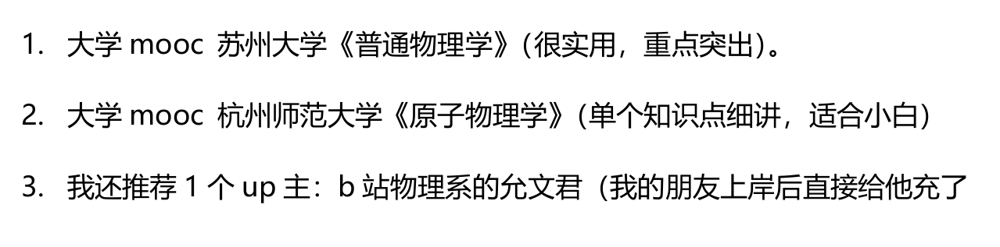

### 2026年4月8日
1. 明日计划
   1. 333 私人讲学的兴起与发展，孔子教育思想与教育实践；   4h
   2. 英语二 计划以及长难句一句，准备试题材料
   3. 物理 整理经验贴，写学习计划，完成第一天的学习
   4. 文具准备  笔记本购买，涂色笔购买等其他，以及吃的准备。
2. 工作计划
   1. 高考题，湖北卷，完整走一遍，晚上要复盘
   2. 下午上一节课，晚上自习，安排作业
   3. 做完高考题之后，出卷子
   4. 备课完成磁场部分备课。
3. 加油加油加油。

### 2026年4月9日
1. 英语备考
   1. jie斌斌 哔哩哔哩上有，长难句66   5月完成，一天一句，
   2. 背单词  每天150词，红宝书乱序版，预计两个月完成一轮，
   3. 唐迟阅读方法论 4月完成 总共8课，两天看一课，在夸克上面
   4. 5月开始做真题 先做英语一，再做英语二   听老师的讲解，黄皮书对答案，夸克上有，单词，翻译，二刷掐时间15-20min
2. 政治：暑假7月开始，马原要看，历史要看。1000题开始写，暑假写完，后期搜攻略
3. 物理 与高中学习步骤差不多
   1. 
   2. 普通物理学  只看力热电  
   3. 允文君 力热电光原
   4. 7月之前完成一轮，也就是80天时间，力学20天，热学 15天，电学 20天，光学 15天，原子物理学10天，总共计划83天。不行再调整，注意自己学完合上书要有输出。可以不过习题。
      1. 力学 总共18节内容，有记忆要求。一天1节-2节学习，前面几个可以快点，都会  结合物理mo王习题写，
      2. 热学 总共14节，记忆负担大，一天一节。这里要花时间自己推理记忆。
      3. 电学 总共23节，每天一节。重点考察内容。两本书结合一起看
      4. 光学 12节  两本书结合一起看
      5. 原子物理学  18节，一天2节，结合视频看
   5. 过物理mo王习题 暑假期间，可以慢慢刷起来真题了。
4. 333  跟课
   1. 6月完成两本书学习。
   2. 其他跟课
5. 今日复习计划
   1. 力学三节内容
   2. 英语完成哔哩哔哩一个斌视频学习练习，单词150个
   3. 333 孔子，私人讲学
   4. 加油加油加油