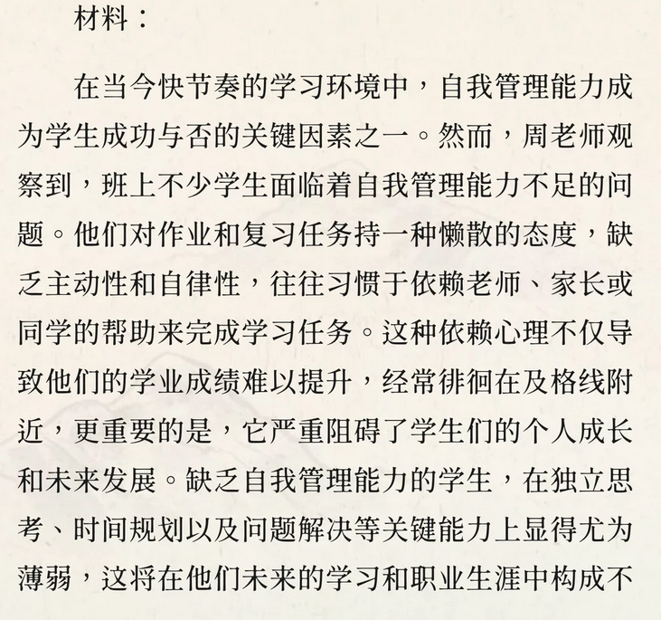
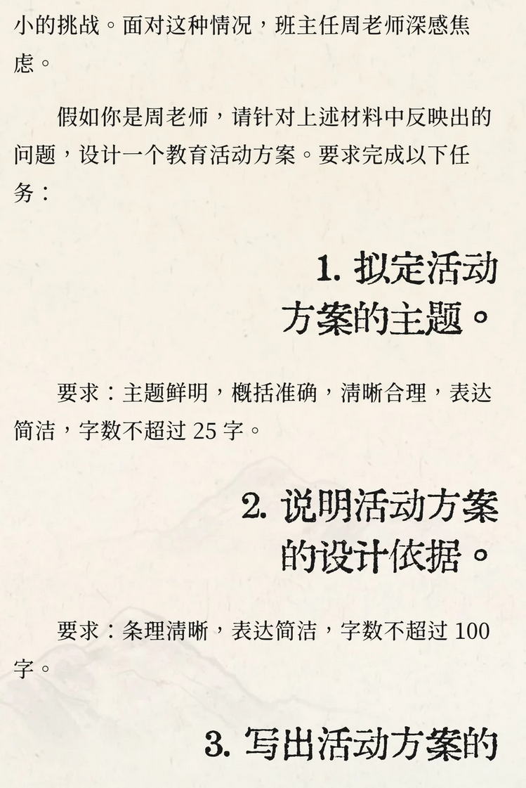
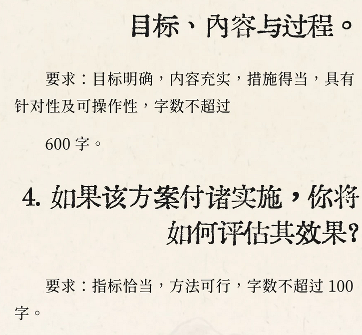

### 第一题

  - 活动主题：心有标尺，行有自律，学有自主
  - 活动依据：学生心理发展尚不成熟，意志力薄弱，自我约束能力差。鉴于本班出现了过于懒散、过度依赖他人等问题，为了增强学生的自我管理意识，促进学生全面发展，特召开本次班会。
  - 活动目标：
    - 1.认知目标：学生明晰自我管理的意义，认清依赖心理的危害。
    - 2.行为目标：掌握基本的自我管理方法，能够合理规划自己的时间，初步学会独立解决难题。\\学生掌握时间规划等实用方法，初步具备独立解决学习任务、解决学习难题的基础能力。\\
    - 3.情感目标：激发学生的学习主动性与自律意识，树立自我管理意识。
  - 活动内容与过程：
    - 1.情景导入，叩问初心。
      - 播放视频：学生常见的依赖型学习场景：如拖延、懒散，成绩徘徊及格线等。教师提问：视频中场景熟悉吗？你是否也是其中一员？当我们依赖他人时，丢了哪些能力？这节课一起认识并学会自我管理。
    - 2.问题探究，正式现状
      - 困惑分享：PPT展示课前调研收集的匿名困惑，如“没人监督就不想写作业”“学习计划总是不想完成、拖延”。
      - 小组讨论：探讨问题的根源是什么。
      - 代表发言+教师总结：各小组分享观点，教师提炼总结观点：缺乏自主意识，懒散的态度是根源\\缺乏自主意识，学习动力不足\\
     - 3.方法习得，干货赋能
        - 榜样分享：邀请班级自我管理优秀的学生，结合自身经历分享实操方法。
        - 教师PPT传授自我管理技巧：时间规划-五分钟规划法；任务拆解-小步子原则；自主监督-打卡激励法；\\组内互助-互相打卡激励\\
     - 4.承诺践行，锚定行动
        - 1.现场实操：给学生发放便签纸，现实2分钟，学生现场规划一个学习任务，教师随机抽取点评。
        - 2.写下承诺：发放自我管理挑战卡，学生写下自己最想改变的依赖毛病挂在班级展示墙上，定期复盘打卡，评选“自律小标兵”。
     - 5.总结升华，寄语前行
        - 教师寄语：自律者得自由，自主者致远。自我管理不是一蹴而就的，贵在坚持，愿大家以今日为起点，以自律为翼，自主为帆，在学习生活中稳步前行，遇见更好的自己。
  - 效果检验方法：
    - 电话访谈。
    - 观察
