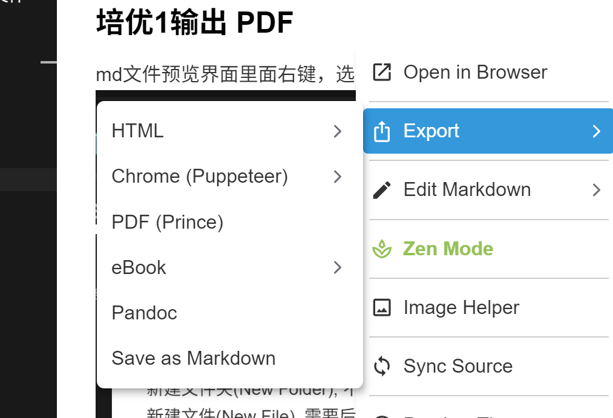
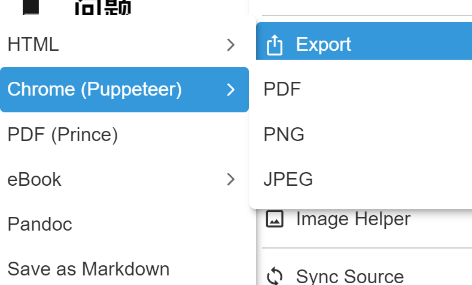
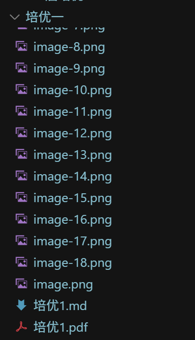

# 笔记实践概述
新建文件夹(New Folder), 不需要后缀
新建文件(New File), 需要后缀 `.md`
`---`表示换行
特殊符号可以用英文符号` `表示

## 保存改动
1. 输入本次改动的大概介绍(左上角)

2. 保存(左上角)

3. 上传到网盘(左下角)

## 问题

### 培优1的图片就在培优1里面
结论：不能在`培优1.MD`文件里面, 因为md笔记和图片都是文件
因为文件不能再包含文件
所以要用文件夹把 md 笔记和图片包起来

### 培优1输出 PDF 
md文件预览界面里面右键，选择export，点击pdf导出

---

---

---

---
会粘到当前文件夹下面

想要导出pdf，总结拖拽到桌面即可
