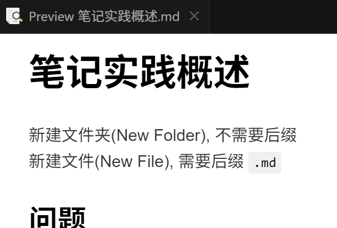

# 笔记实践概述
新建文件夹(New Folder), 不需要后缀
新建文件(New File), 需要后缀 `.md`
`---`表示换行
特殊符号可以用英文符号` `表示

## 保存改动
1. 输入本次改动的大概介绍(左上角)

2. 保存(左上角)

3. 上传到网盘(左下角)

## 问题

### 培优1的图片就在培优1里面
结论：不能在`培优1.MD`文件里面, 因为md笔记和图片都是文件
因为文件不能再包含文件
所以要用文件夹把 md 笔记和图片包起来

### 培优1输出 PDF 
md文件预览界面里面右键，选择export，点击pdf导出

---

---

---

---
会粘到当前文件夹下面

想要导出pdf，总结拖拽到桌面即可

### 如何输入公式示例
1.举例 
  - 一个符号要用一对`$ $`表示比如输入下标就要$v$$_1$表示
  - `$$`只能表示一行的公式，如果公式比较长则用`$$ $$`生效，即为硬要换行写一个公式，比如行列式

2.代码举例
$(1+x)^{\alpha} - 1$ ~ $\alpha x$
$\int_a^b f(x)dx = \displaystyle lim_{n \rightarrow \infin}\frac{b-a}{n} \sum_{i=1}^nf(\xi_i)$

### 如何引用前面的内容
`[随便命名如reference](../../../)`
.表示回到上一行目录，/表示访问里面的文件，点击选择即可，如果还没有找到，则再次.访问上一行目录
注意：符号用英文符号