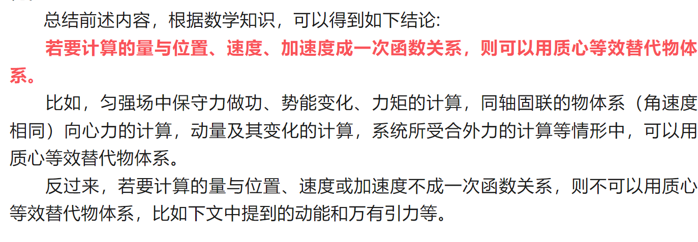
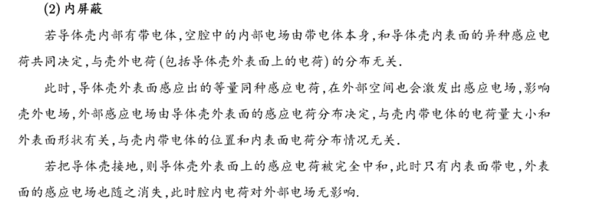
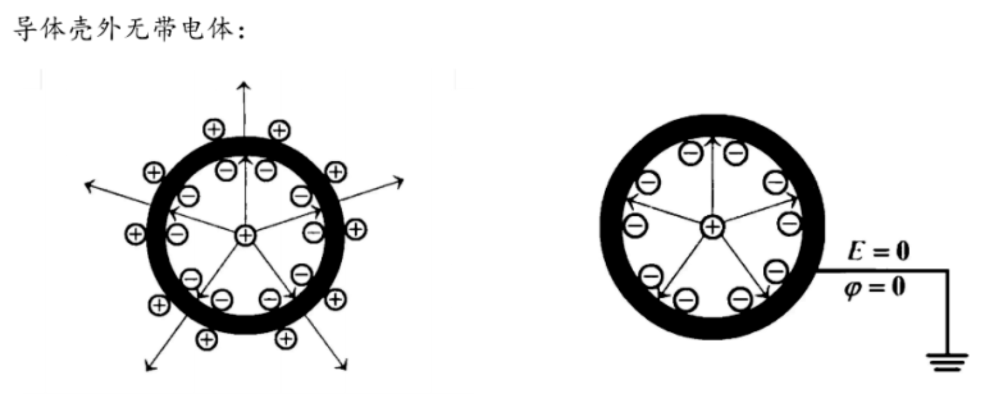
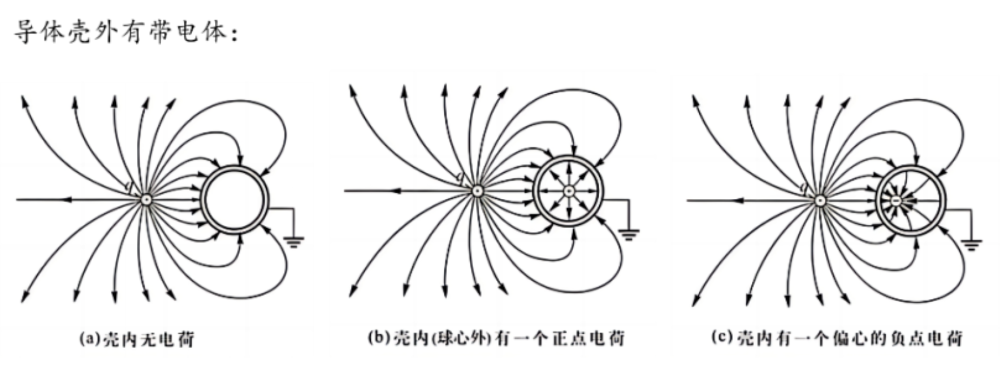
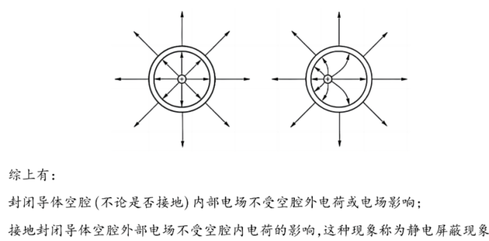

### 电容器
  - 充电放电的电流变化的原因
    - 
  $(fra)$ ~ $\alpha x$

### 质心相关知识
  - 1. 对物体速度、加速度、合外力、动量等，也可以用质心概念进行计算或者简化。
  - 2. 若要计算的量与位置、速度、加速度成一次函数关系，则可以用质心等效替代物体系。      
      - 比如，匀强场中保守力做功、势能变化、力矩的计算，同轴固联的物体系（角速度相同）向心力的计算，动量及其变化的计算，系统所受合外力的计算等情形中，可以用质心等效替代物体系。      
      - 反过来，若要计算的量与位置、速度或加速度不成一次函数关系，则不可以用质心等效替代物体系，比如下文中提到的动能和万有引力等。
    

### 静电平衡
  - 1. 静电屏蔽之内屏蔽
      - 第一个要点 金属球壳内部的电场分布只和内部的电荷有关，和外部电场无关，并且内部电场会影响外部电场的分布，如果球壳接地，对外部电场无影响
      - 第二个要点 金属球壳内部的电荷位置不同不影响它再外部电场分布，如果是一个金属球壳可以等效为一个点电荷在中心产生的电场。
      - 
      - 
      - 
      - 
      - 