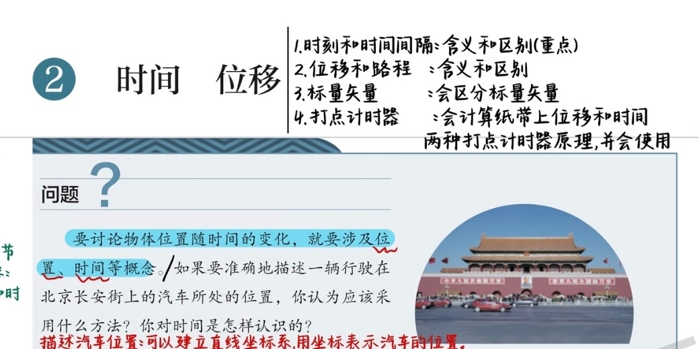
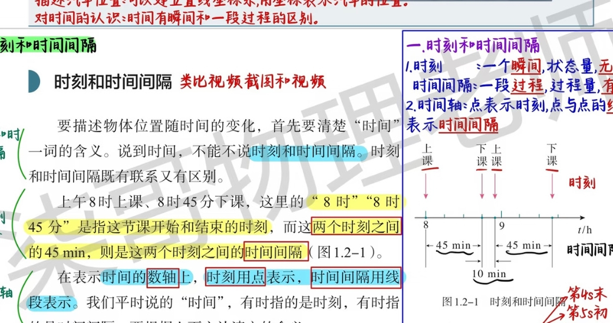
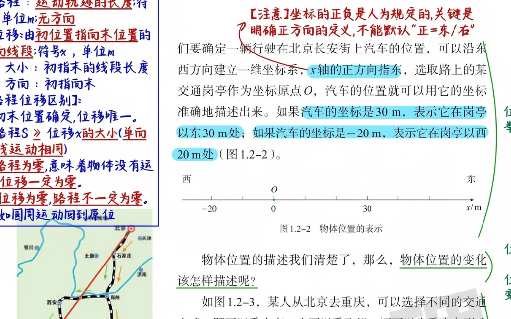
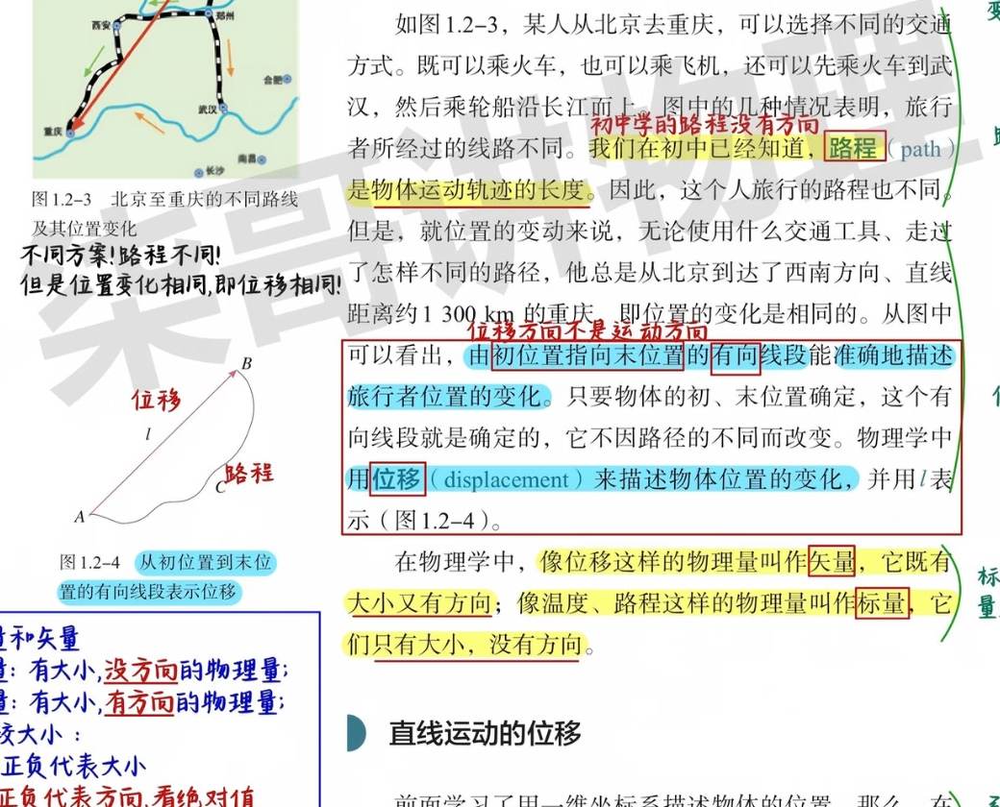
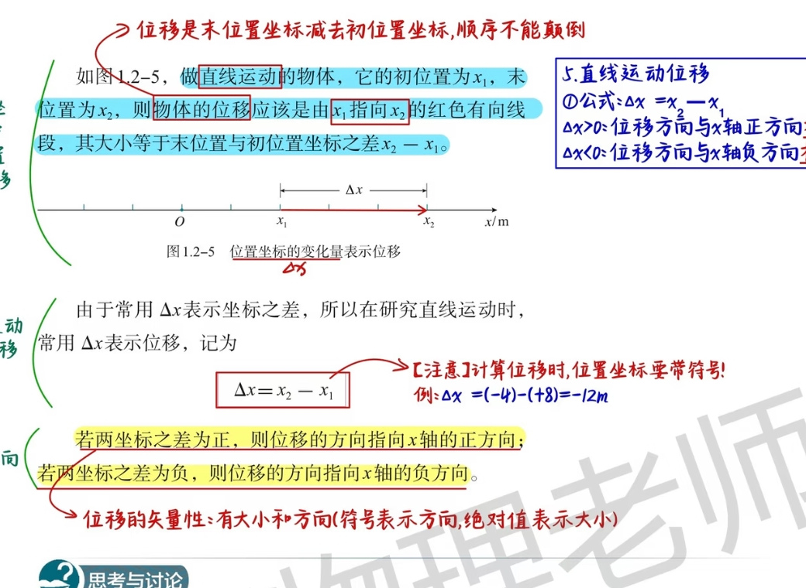
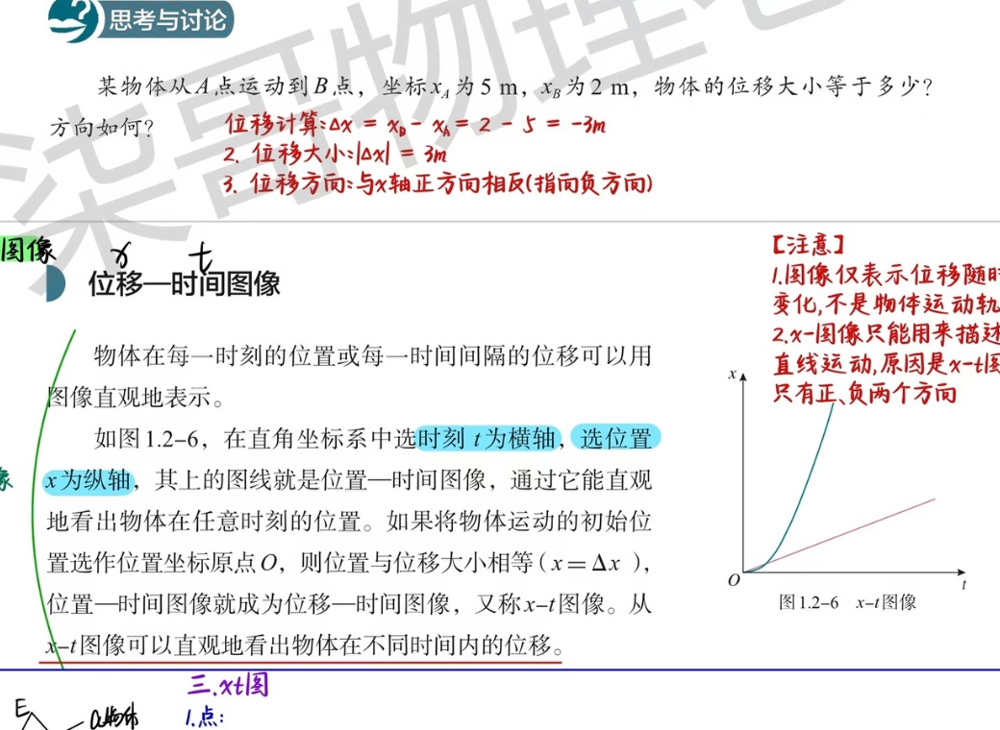
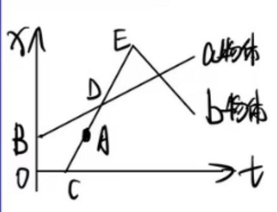
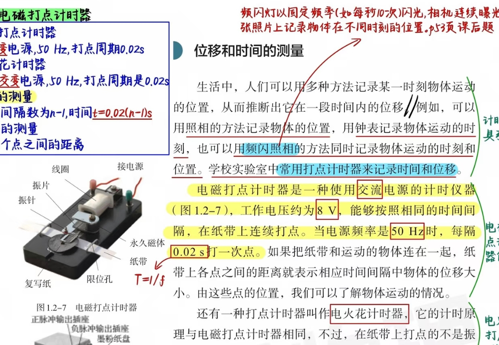
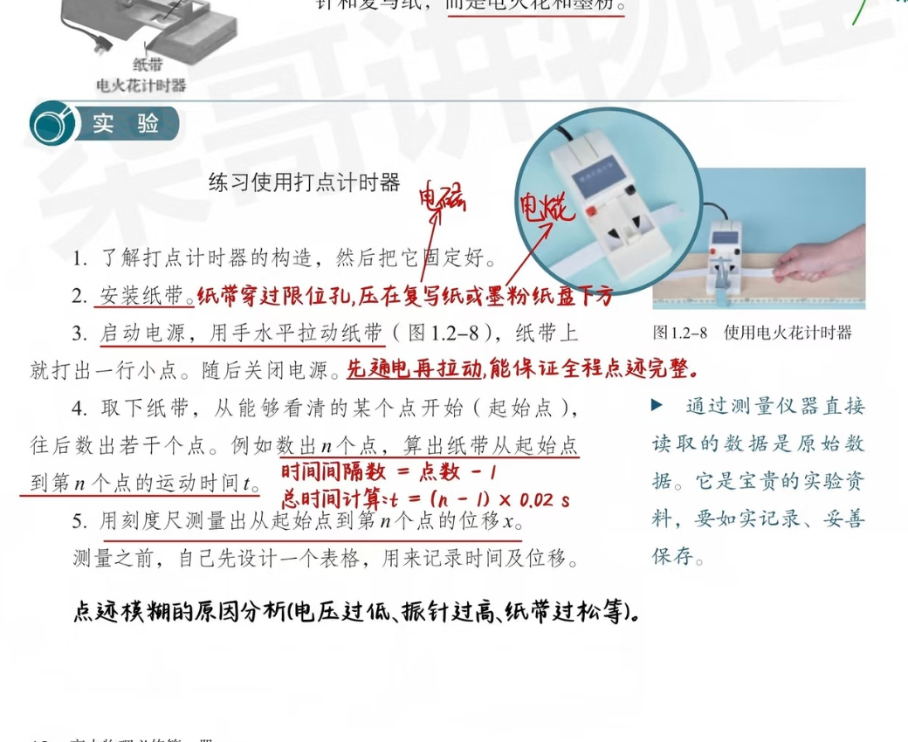

# 1.2 时间和位移教学设计

> 适用年级：高一年级（人教版高中物理必修第一册）  
> 课题：第一章《运动的描述》1.2 时间和位移  
> 建议课时：2课时（每课时45分钟，可按班级学情压缩或延展）  
> 资料来源：教师提供的四张教材批注原图及其中的手写、标色内容。文中保留与知识点对应的局部批注截图，便于备课和授课时核对。

## 一、总括

### 1. 课标定位与核心问题

本节从“如何描述一辆行驶在北京长安街上的汽车位置”这一问题导入，建立描述运动的两个基本维度：时间和空间位置。学生需要经历“生活语言—坐标语言—图像语言—实验数据”的转换，理解时刻、时间间隔、位置、路程、位移、标量、矢量等概念，并能用打点计时器获得时间和位移数据。

**核心问题**：

- 怎样准确说清物体“在什么时候、在哪里”？
- 走过的路线长度和初、末位置的变化有什么不同？
- 如何从 \(x\text{-}t\) 图像读出某时刻的位置、相遇时刻和运动快慢？
- 如何用仪器同时测量运动的时间和位移？

### 2. 教学目标

1. **知识与技能**：准确区分时刻与时间间隔、位置与路程、路程与位移、标量与矢量；会建立一维坐标系，读写位置坐标；掌握直线运动位移公式 \(\Delta x=x_2-x_1\)；能读懂简单的 \(x\text{-}t\) 图像；了解电磁打点计时器、电火花计时器和频闪照相的原理并会按规范操作。
2. **过程与方法**：通过时间轴、路线图、坐标轴、位移箭头和 \(x\text{-}t\) 图像，把抽象概念转化为可视化模型；通过“北京—重庆”路线比较和打点纸带实验，体验从原始数据推断运动状态的过程。
3. **科学思维与态度**：形成“先规定参考系和正方向，再描述物理量”的意识；计算位移时保留坐标正负号；如实记录、妥善保存实验原始数据，能对点迹模糊等实验现象作出原因分析。

### 3. 教学重点、难点与易错点

- **重点**：时刻与时间间隔的区分；路程与位移的区分；标量与矢量的判别；直线位移的正负号；\(x\text{-}t\) 图像的读图；打点计时器的时间计算。
- **难点**：理解位移由初位置指向末位置且与路径无关；理解坐标正方向是人为规定的；理解 \(x\text{-}t\) 图像不是物体运动轨迹；在“第 \(n\) 个点”与“\(n\) 个时间间隔”之间正确换算。
- **易错提醒**：位移计算顺序不能颠倒；位移为负不表示“大小为负”，而表示方向；路程恒为非负且无方向；\(n\) 个点只有 \(n-1\) 个间隔；电源应先接通再拉纸带。

### 4. 教学准备与总体流程

- **准备**：教材批注原图、时间轴和 \(x\text{-}t\) 图像投影；电磁打点计时器或电火花计时器、纸带、刻度尺、复写纸/墨粉纸盘、导线和低压交流电源；频闪照片（或视频截图）。
- **第1课时**：问题导入 → 时刻和时间间隔 → 坐标系与位置 → 路程和位移 → 标量与矢量 → 直线位移练习。
- **第2课时**：\(x\text{-}t\) 图像 → 频闪照相 → 两种打点计时器 → 纸带实验 → 数据处理与小结。
- **评价方式**：课堂口头辨析、坐标和位移计算、图像读图、纸带数据表、出口条（exit ticket）。

## 第一部分 时刻和时间间隔

### 1. 导入与概念建构

**教师导入语**：要讨论物体位置随时间的变化，就要涉及位置、时间等概念。如果要准确描述一辆行驶在北京长安街上的汽车所处的位置，应采用什么方法？你对“时间”是怎样认识的？

引导学生发现：描述汽车位置可以建立直线坐标系，用坐标表示汽车的位置；描述变化还必须区分“一个瞬间”和“一段过程”。

### 2. 时刻与时间间隔的定义

- **时刻**：表示某一瞬间，是状态量，没有长短。例如“上午8时上课”“8时45分下课”中的“8时”和“8时45分”都是时刻。
- **时间间隔**：表示两个时刻之间的一段过程，是过程量，有长短。上述两个时刻之间的 \(45\,\mathrm{min}\) 就是时间间隔。
- 二者有联系也有区别：时间间隔由两个时刻确定；日常所说“时间”可能指时刻，也可能指时间间隔，必须根据上下文判断。

在时间数轴上，**时刻用点表示，时间间隔用点与点之间的线段表示**。时间轴上的箭头表示时间增大的方向，刻度单位可用 \(\mathrm{s}\)、\(\mathrm{min}\)、\(\mathrm{h}\)。

### 3. 板书与活动设计

1. **类比活动**：播放一段短视频和视频截图。截图对应某一时刻；视频从开始到结束对应时间间隔。让学生用“点/线段”在黑板时间轴上表示。
2. **时间轴辨析**：标出“第 \(4\,\mathrm{s}\) 末”和“第 \(5\,\mathrm{s}\) 初”，强调它们是同一时刻；标出“第 \(4\,\mathrm{s}\) 内”“前 \(3\,\mathrm{s}\) 内”，强调它们是时间间隔。
3. **统一表达**（沿用批注）：
- “第 \(n\,\mathrm{s}\) 末”和“第 \((n+1)\,\mathrm{s}\) 初”表示同一时刻；
- “第 \(n\,\mathrm{s}\) 内”表示从第 \((n-1)\,\mathrm{s}\) 初到第 \(n\,\mathrm{s}\) 末的 \(1\,\mathrm{s}\) 时间间隔；
- “前 \(n\,\mathrm{s}\) 内”表示从0时刻到第 \(n\,\mathrm{s}\) 末的时间间隔。
4. **快速检测**：
   - “8时45分到9时”是时刻还是时间间隔？（时间间隔）
   - “第 \(5\,\mathrm{s}\) 初”与“第 \(4\,\mathrm{s}\) 末”是否相同？（相同）
   - “第 \(5\,\mathrm{s}\) 末”在时间轴上用什么表示？（一个点）

### 4. 小结句

看到“某时刻、几时几分、第 \(n\,\mathrm{s}\) 初/末”，优先判断为时刻；看到“经过、用时、持续、前 \(n\,\mathrm{s}\) 内、第 \(n\,\mathrm{s}\) 内”，优先判断为时间间隔。

## 第二部分 位置和位移

### 1. 坐标系与位置

为定量描述物体的位置，需要在参考系上建立适当的**坐标系**。平面运动可用平面直角坐标系；直线运动可用一维坐标系。

一维坐标系的三个要素是：**原点、正方向、单位长度**。研究直线运动时通常选运动所在直线为 \(x\) 轴，在 \(x\) 轴上选一点为原点，规定正方向和单位长度。正方向是人为规定的，关键是事先明确，不能默认“正方向就是向东或向右”。

**位置**：物体在某个时刻所处的空间点；在一维坐标系中用该点的坐标 \(x\) 表示。

**位置示例**：沿东西方向建立一维坐标系，取交通岗亭为原点 \(O\)，规定向东为 \(x\) 轴正方向：

- \(x=30\,\mathrm{m}\)：汽车在岗亭以东 \(30\,\mathrm{m}\) 处；
- \(x=-20\,\mathrm{m}\)：汽车在岗亭以西 \(20\,\mathrm{m}\) 处。

### 2. 路程与位移

**路程 \(s\)**：物体运动轨迹的长度，是标量，单位通常为 m，无方向。

**位移**：由初位置指向末位置的有向线段，用来描述物体位置的变化，直线运动中常用 \(\Delta x\) 表示；教材图示也用 \(l\) 标注有向线段。位移的大小等于初、末位置间有向线段的长度，方向由初位置指向末位置。

**路线比较活动**：北京到重庆可以乘火车、乘飞机，或先乘火车到武汉再乘轮船。路线不同，路程不同；但初位置和末位置相同，由初位置指向末位置的有向线段相同，所以位移相同（直线距离约为 \(1300\,\mathrm{km}\)）。位移与路径无关，只由初、末位置决定。

路程与位移的区分（手写批注要点）：

1. 初、末位置确定时，位移唯一；
2. 路程 \(s\geqslant\lvert\Delta x\rvert\)，单向直线运动时二者相等；
3. 若路程 \(s=0\)，意味着物体没有运动，位移一定为 \(\Delta x=0\)；但若位移 \(\Delta x=0\)，路程不一定为零，例如物体做圆周运动后回到原位置。

### 3. 标量与矢量

- **标量**：只有大小、没有方向的物理量，如路程、温度、质量、时间等。
- **矢量**：既有大小、又有方向的物理量，如位移、速度、力等。
- 比较时要分清“数值”和“大小”：在手写批注的约定中，标量的正、负可直接参与大小比较；一维矢量的正、负号表示方向，绝对值表示大小。例如 \(\Delta x=-3\,\mathrm{m}\) 的大小是 \(3\,\mathrm{m}\)、方向沿 \(x\) 轴负方向，不能把 \(-3\,\mathrm{m}\) 理解成负的长度；温度 \(-3\,^{\circ}\mathrm{C}<+1\,^{\circ}\mathrm{C}\)，而位移的正负首先表示方向，比较大小应比较绝对值。
- 常见物理量归类（批注）：标量有路程、温度、质量、时间等；矢量有位移、速度、力等。

### 4. 直线运动的位移

设物体做直线运动，初位置坐标为 \(x_1\)，末位置坐标为 \(x_2\)。位移是由 \(x_1\) 指向 \(x_2\) 的有向线段，大小（带符号的代数量）为：

\[
\boxed{\Delta x=x_2-x_1}
\]

位移是“末位置坐标减初位置坐标”，顺序不能颠倒。计算时位置坐标必须带正负号：

- \(\Delta x>0\)：位移方向与 \(x\) 轴正方向相同；
- \(\Delta x<0\)：位移方向与 \(x\) 轴正方向相反，指向 \(x\) 轴负方向；
- 位移大小为 \(\lvert\Delta x\rvert\)，符号表示方向。

**例题（手写批注原例）**：物体从 A 点运动到 B 点，\(x_A=5\,\mathrm{m}\)，\(x_B=2\,\mathrm{m}\)。

\[
\Delta x=x_B-x_A=2-5=-3\,\mathrm{m},\qquad \lvert\Delta x\rvert=3\,\mathrm{m}
\]

位移方向与 \(x\) 轴正方向相反，即指向负方向。

**带符号计算提醒（批注例）**：若 \(x_2=-4\,\mathrm{m}\)、\(x_1=+8\,\mathrm{m}\)，必须写成 \(\Delta x=(-4)-(+8)=-12\,\mathrm{m}\)，不能漏掉坐标的正、负号。

**课堂练习**：让学生先画 \(x\) 轴并标出 \(x_A、x_B\)，再写“末−初”，最后分别回答位移、位移大小和方向，避免只报“\(3\,\mathrm{m}\)”而漏掉方向。

## 第三部分 时间—位移图像

### 1. 图像建立

物体在每一时刻的位置，或每一时间间隔内的位移，都可以用图像直观表示。在直角坐标系中取时刻 \(t\) 为横轴、位置 \(x\) 为纵轴，所得图线叫**位置—时间图像**，简称 \(x\text{-}t\) 图像。

若把物体运动的初始位置选作坐标原点 \(O\)，则 \(x=\Delta x\)，位置—时间图像就成为位移—时间图像，仍简称 \(x\text{-}t\) 图像。由图像可以直接读出物体在不同时间的位置（或位移）。

### 2. 手写批注中的读图规则

- **点的意义**：图线上任意点 A 表示“某时刻、某位置”。
- **截距**：横截距点（如 C）表示物体到达 \(x=0\) 位置的时刻；纵截距点（如 B）表示 \(t=0\) 时物体的初始位置。
- **交点**：两条图线交点 D 表示同一时刻、同一位置，即相遇点。
- **拐点/转折点**：如 E 所示，图线倾斜方向改变，表示速度方向发生改变（实际判断还应结合坐标正方向）。
- **斜率**：图线斜率 \(k=\dfrac{\Delta x}{\Delta t}\)（图线倾斜程度）表示速度；斜率为正、负分别对应沿 \(x\) 轴正、负方向运动，斜率绝对值越大表示速度大小越大。

### 3. 读图活动与注意事项

1. 给出两条直线 \(x\text{-}t\) 图线，让学生读出某时刻的位置、到达原点的时刻和相遇时刻。
2. 比较同一时刻两物体的位置，比较同一物体两段图线的斜率，说明“位置”和“速度”是不同信息。
3. 强调：\(x\text{-}t\) 图像仅表示位移（或位置）随时间的变化，**不是物体运动的实际轨迹**；由于一维坐标 \(x\) 只有正、负两个方向，\(x\text{-}t\) 图像只能描述物体的直线运动。

## 第四部分 位移和时间的测量

### 1. 时间的测量与频闪照相

生活中可以用多种方法记录某一时刻物体运动的位置，从而推断一段时间内的位移：用照相记录位置，用钟表记录时刻，也可以用**频闪照相**同时记录物体运动的时刻和位置。频闪灯以固定频率（例如每秒闪光10次）发光，相机连续曝光，在同一张照片上留下物体在不同时间的位置。频闪照相的时间间隔由闪光频率决定，可作为课后练习题或拓展活动。

学校实验室常用打点计时器记录时间和位移。

### 2. 电磁打点计时器与电火花打点计时器

| 仪器 | 电源与频率 | 打点周期 | 纸带上的点迹 |
| --- | --- | --- | --- |
| 电磁打点计时器 | 约 \(8\,\mathrm{V}\) 交流电源；\(50\,\mathrm{Hz}\) | \(T=1/f=0.02\,\mathrm{s}\) | 振针在复写纸上连续打点 |
| 电火花计时器 | \(220\,\mathrm{V}\) 交流电源；\(50\,\mathrm{Hz}\) | \(T=0.02\,\mathrm{s}\) | 电火花在墨粉纸上留下点迹 |

电磁打点计时器按相同时间间隔在纸带上连续打点；当纸带与运动物体相连时，相邻点间距离表示相应时间间隔内物体位移的大小。电火花打点计时器原理相同，但纸带上留下的不是振针和复写纸的点迹，而是电火花和墨粉。

### 3. 位移的测量与纸带实验操作流程

1. 了解打点计时器的构造，将仪器固定好。
2. 安装纸带：纸带穿过限位孔，压在复写纸或墨粉纸盘下方。
3. 接通电源，用手水平拉动纸带，纸带上打出一行小点，随后关闭电源。强调“**先通电，再拉动**”，才能保证全程点迹完整。
4. 取下纸带，从能看清的某个点开始作为起始点，向后数出若干个点。若数出 \(n\) 个点，则点间隔数为 \(n-1\)，从起始点到第 \(n\) 个点的时间为
   
   \[
   t=(n-1)T=(n-1)\times0.02\,\mathrm{s}
   \]

5. 用刻度尺（直尺）测量从起始点到第 \(n\) 个点的位移 \(x_0\)，即两点之间的距离；测量前先设计表格，记录点号、时间和位移。

### 4. 数据表与误差分析

建议学生使用如下原始数据表：

| 起始点 | 终点点号 \(n\) | 间隔数 \(n-1\) | 时间 \(t/\mathrm{s}\) | 位移 \(x_0/\mathrm{m}\) | 备注 |
|---|---:|---:|---:|---:|---|
| 0 | 2 | 1 | 0.02 |  |  |
| 0 | 3 | 2 | 0.04 |  |  |
| 0 | … | … | … |  |  |

通过测量仪器直接读取的数据是原始数据，是宝贵的实验资料，应如实记录、妥善保存。若点迹模糊，可从以下方面分析：电压过低、振针过高、纸带过松等；同时检查纸带是否穿过限位孔、是否压在复写纸/墨粉纸下方，以及拉动是否水平匀速。

### 5. 实验评价

- 能说出两种计时器的共同原理和打点介质差异；
- 能根据 \(n\) 个点写出 \(n-1\) 个时间间隔并算出总时间；
- 能用刻度尺测量起始点到终点的位移，并把单位写全；
- 能根据点间距大小规律初步判断物体运动快慢的变化。

## 第五部分 小结

### 1. 知识结构

- **时间**：时刻（一个瞬间、状态量、无长短）；时间间隔（一段过程、过程量、有长短）；时间轴上点表示时刻，线段表示时间间隔。
- **空间描述**：坐标系（原点、正方向、单位长度）→ 位置坐标 \(x\)。
- **运动变化**：路程 \(s\)（轨迹长度、标量）；位移 \(\Delta x\)（初位置指向末位置、矢量）。
- **直线位移**：\(\Delta x=x_2-x_1\)；\(\lvert\Delta x\rvert\) 表示大小，正负号表示方向。
- **图像**：\(x\text{-}t\) 图像，横轴 \(t\)、纵轴 \(x\)；斜率表示速度。
- **测量**：频闪照相、打点计时器；\(n\) 个点对应 \(n-1\) 个时间间隔。

### 2. 课堂出口条

1. “第 \(6\,\mathrm{s}\) 末”和“第 \(7\,\mathrm{s}\) 初”是同一时刻吗？请在时间轴上说明。
2. 物体从 \(x_1=-4\,\mathrm{m}\) 运动到 \(x_2=+6\,\mathrm{m}\)，求位移及方向。
3. 物体绕一周回到原点，路程和位移分别可能是多少？二者为何不同？
4. \(x\text{-}t\) 图像中两线交点、斜率分别表示什么？
5. 打点纸带从起始点数到第8个点，频率 \(50\,\mathrm{Hz}\)，时间是多少？

**参考答案**：1. 是；2. \(\Delta x=10\,\mathrm{m}\)，沿 \(x\) 轴正方向；3. 路程 \(s>0\)，位移 \(\Delta x=0\)；4. 同时同位置（相遇）、速度；5. \(t=(8-1)\times0.02=0.14\,\mathrm{s}\)。

### 3. 课后延伸

让学生拍摄一个小球或玩具车的连续运动，尝试用固定时间间隔的照片记录位置，画出简易 \(x\text{-}t\) 图像，并在图中标注初位置、末位置、相遇（若有）和速度方向变化。下节课用纸带实验数据与照片数据进行比较。
