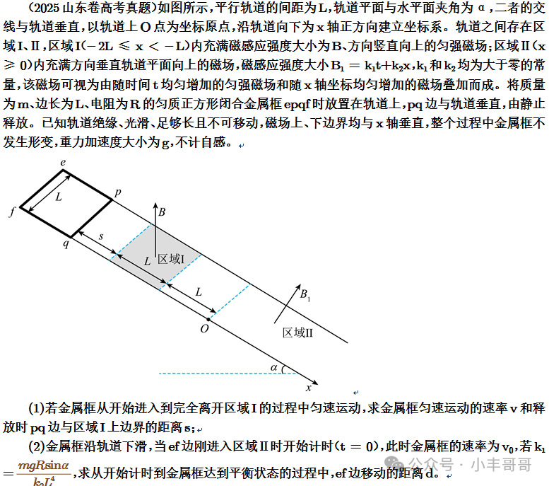
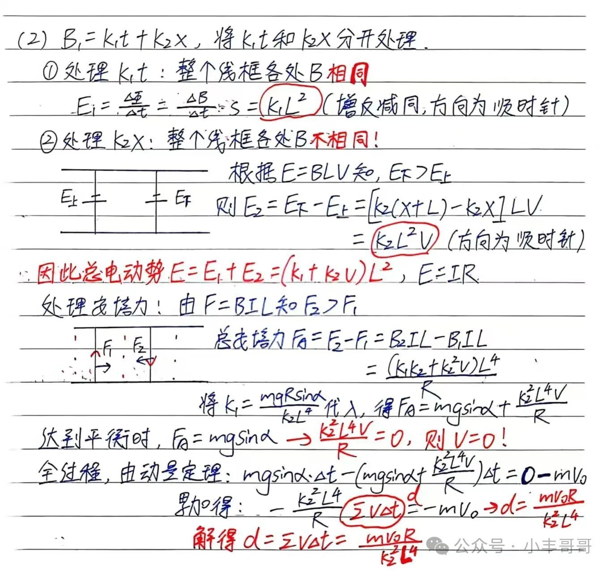
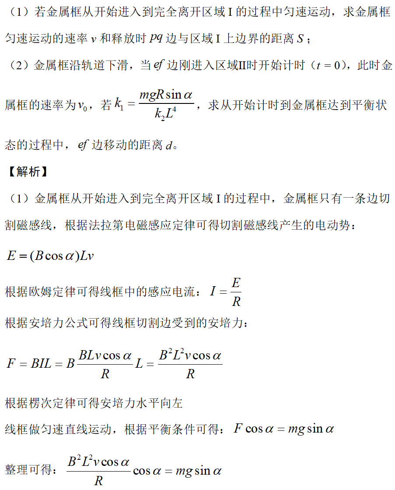
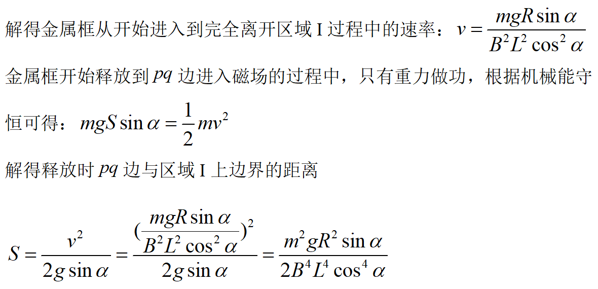
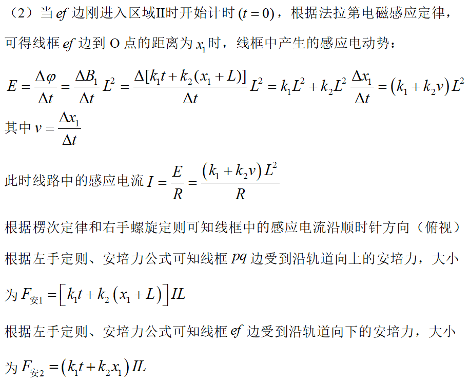
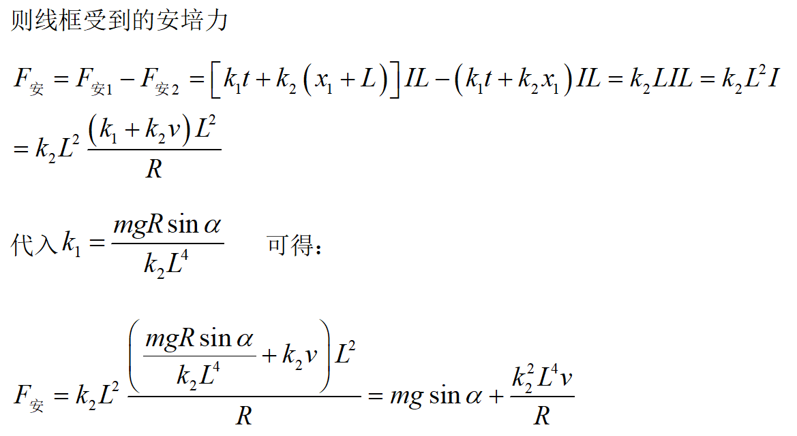
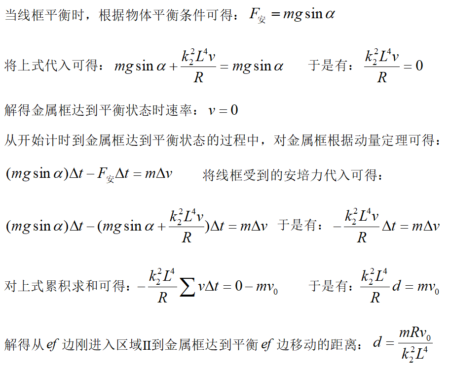

- 解题思路：注意审题，
  - 第一题的磁感应强度与斜面不垂直，此时要进行分解
  - 第二题题目中说到受力平衡，所以要通过平衡条件求解出位移与时间的关系，再由动量定理求解。也是注意审题，题目中说了ef进入磁场，所以整个线框再磁场中，利用法拉第电磁感应定律求导时只有磁感应强度在变。面积没有变化。
    - 另外题目中给了提示，把两种电动势分开进行计算，也就是两种磁场分别求电动势。
    - 也可以先求出总磁通量，随后求导，此处求磁通量要进行积分。
- 解答过程大致分为如下两种
- 
- 
- 
- 
- 
- 
  