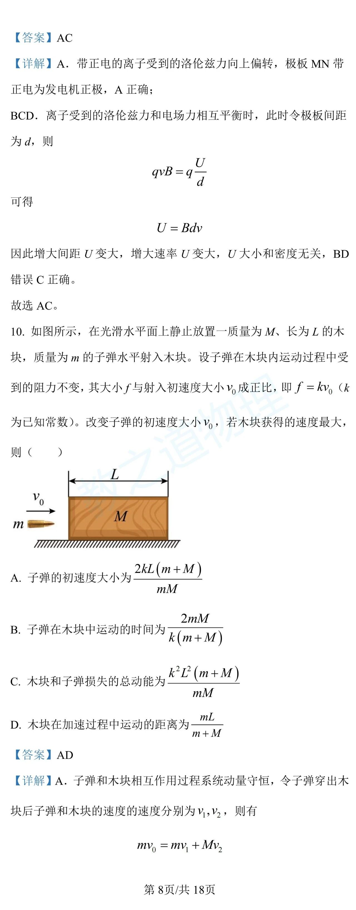
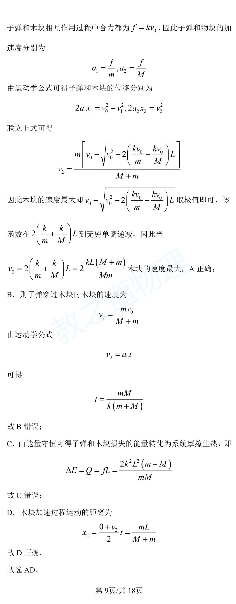
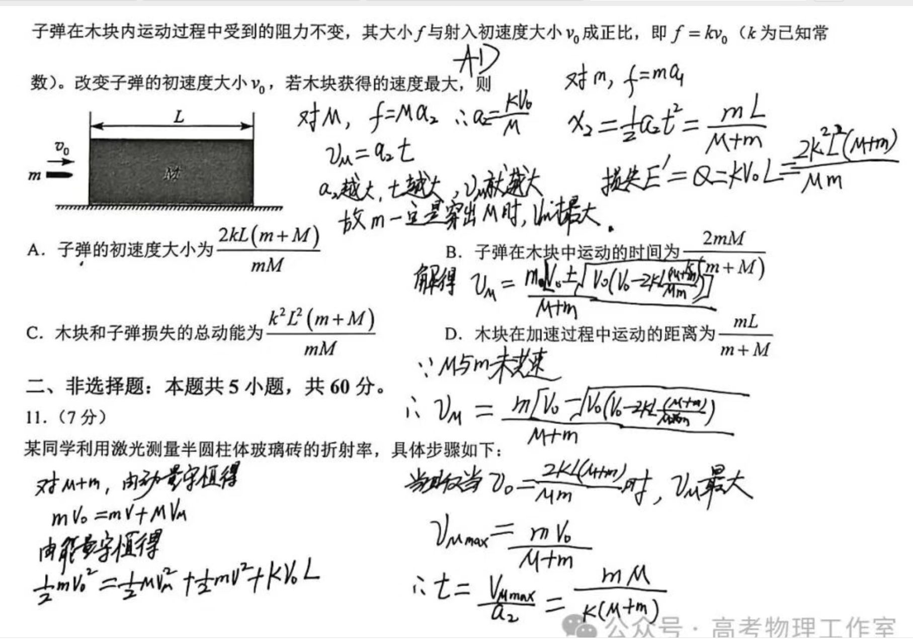
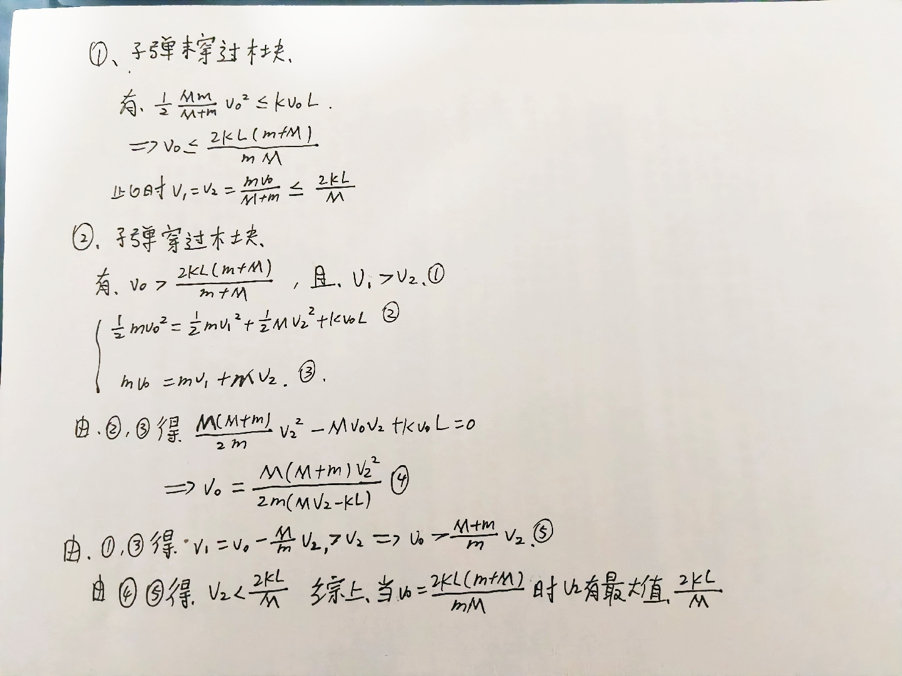
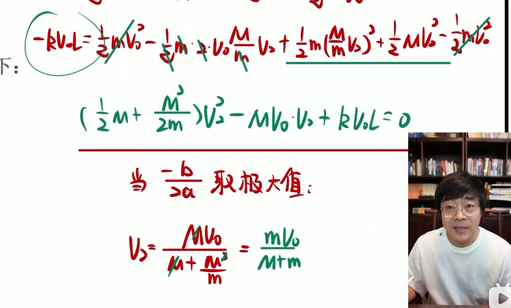
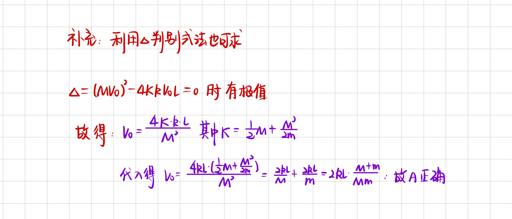
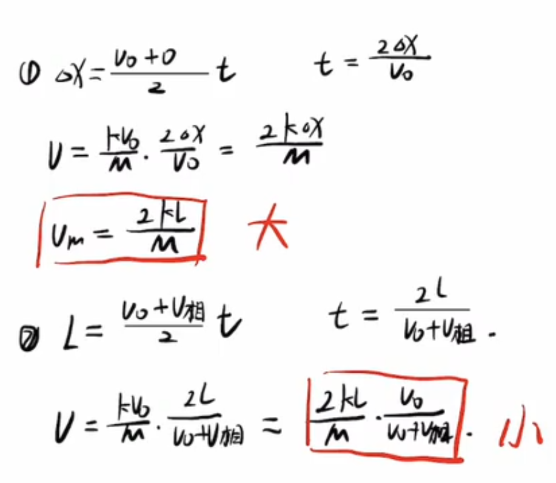
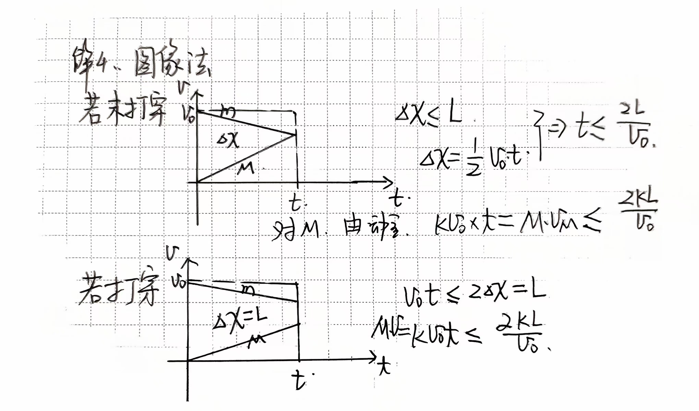

还有其他解法

网上看到的另一种解法
核心是找到v1，v2的大小关系，用v0，v2表示v1；v2表示v0，利用关于v2的不等式求解。

或者是通过能量守恒和动量守恒得到v2的二次方关于v1的方程，
之后的处理方式
  -处理一、用什么关系得到，原理是什么？疑问

  -处理二、用求根公式得到v2、v0关系，
  

解法三：利用相对速度求解

$v$$_1$ ~ $\alpha x$

解法四：利用图像法求解

